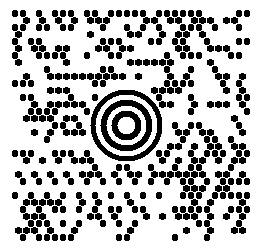

# CSAW Quals 2016: Clams Don't Dance - Forensics 100

>Find the clam and open it to find the pearl.

For this challenge we are given [out.img](https://drive.google.com/open?id=0B8D2vqg5KC_oMld3Y29acUlxcVk), which identifies as a `DOS/MBR boot sector`.

Mounting the image doesn't get us anywhere, so we're probably looking for deleted files, we can check this with sleuthkit:

```bash
$ fls out.img
r/r 3:	USB         (Volume Label Entry)
r/r 5:	._.Trashes
d/d 7:	.Trashes
d/d 10:	.Spotlight-V100
d/d 12:	.fseventsd
r/r * 14:	clam.pptx
r/r 16:	dance.mp4
v/v 3270243:	$MBR
v/v 3270244:	$FAT1
v/v 3270245:	$FAT2
d/d 3270246:	$OrphanFiles
```

There's one deleted file there called `clam.pptx` at inode `14`, which is probably what we want. So I extract that out and unzip it, again using sleuthkit:

```bash
$ icat out.img 14 > clam.zip
$ unzip clam.zip
$ ls
docProps  ppt  _rels  clam.zip  '[Content_Types].xml'  out.img
```

One typical place to hide files in an MS Office document is in the media folder among other images used in the document, so `ppt/media` is a good place to start. Sure enough, the first image in this folder is a MaxiCode picture:



I throw this in [ZXing](https://zxing.org/w/decode.jspx), and out comes the flag:

```
flag{TH1NK ABOUT 1T B1LL. 1F U D13D, WOULD ANY1 CARE??}
```
